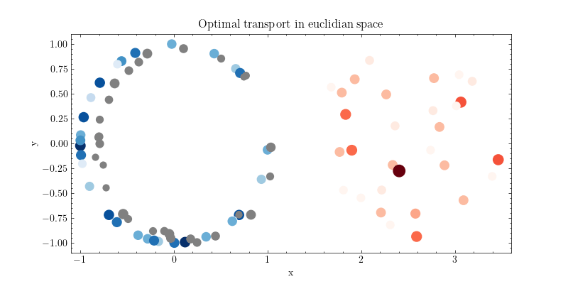

# Computational optimal transport

## Discrete optimal transport
- [Optimal transport between gaussians in R](discrete/Gaussians%20in%20R.ipynb)
- [Optimal transport between gaussians in R2](discrete/Gaussians%20in%20R2.ipynb)
- [Linear program](discrete/Linear%20program.ipynb)
- [Minimum cost bipartite matching](discrete/Minimum%20cost%20bipartite%20matching.ipynb)
- [Relaxing the Monge formulation](discrete/Relaxing%20the%20Monge%20formulation.ipynb)
- [Sinkhorn algorithm and Birkhoff-Von Neuman decomposition](discrete/Sinkhorn%20algorithm%20and%20Birkhoff-von-Neumann%20decomposition.ipynb)
- [Euclidian space](discrete/Euclidian%20space.ipynb)
- [Grayscale histogram equalization](discrete/Grayscale%20histogram%20equalization.ipynb)
- [Image colour transfer](discrete/Image%20colour%20transfer.ipynb)

## Semi-discrete optimal transport
- [Projective gradient ascent](semi-discrete/Gradient%20ascent.ipynb)
- [Nesterov smoothing](semi-discrete/Nesterov%20smoothing.ipynb)

## Wasserstein
- [Wasserstein distance (Bipartite graph formulation and Hungarian algorithm)](wasserstein/Wasserstein%20distance.ipynb)
- [] Approximate wasserstein distance
- [] Sliced wasserstein

## Regularization
- [Entropic regularization](regularization/Entropic%20regularization.ipynb)

## Unbalanced optimal transport

## Partial optimal transport

## Statistical learning and ML
- [Optimal transport as a statistical learning problem](learning/Statistical%20learning.ipynb)
- [] Background density estimation
- [] Density estimation with continuous normalizing flows
- [] Classification
- [] Wasserstein Generative Adverserial Network

## PDEs
- [] Gradient flows
- [] Linear diffusion equation
- [] Non-linear diffusion equation
- [] Mean field limits
- [] Functional inequalities
- [] Geometric inequalities
- [] Ricci curvature
