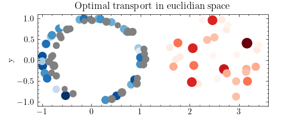

# Computational optimal transport

## Discrete optimal transport

- [x] Optimal transport between gaussians
- [x] Linear program
- [x] Minimum cost bipartite matching
- [x] Relaxing the Monge formulation
- [x] Sinkhorn algorithm
- [x] Birkhoff-Von Neuman decomposition
- [x] Euclidian space
- [x] Grayscale histogram equalization
- [x] Image colour transfer

## Semi-discrete optimal transport
- [x] Projective gradient ascent
- [x] Nesterov smoothing

## Wasserstein
- [x] Wasserstein distance
- [] Approximate wasserstein distance
- [] Sliced wasserstein

## Regularization
- [] Entropic regularization

## Unbalanced optimal transport

## Gradient flows

## Statistical learning
- [x] Optimal transport as a statistical learning problem

## Applications
- [] Background density estimation
- [] Density estimation with continuous normalizing flows
- [] Classification
- [] Wasserstein Generative Adverserial Network
